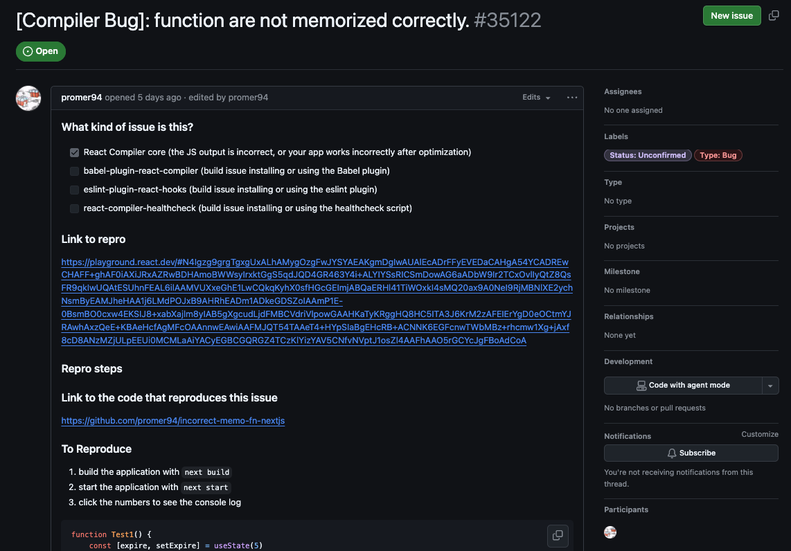

# 🧩 GitHub Issues

**GitHub Issues** are one of the main tools for **team collaboration and task management** within a repository.  
They allow teams to organize work, discuss ideas, report bugs, and plan new features — all in one place.

---

## 📘 What is an Issue?

An **Issue** is a space within GitHub where you can:

- Report **bugs** (project errors)  
- Propose **improvements or new features**
- Ask **questions** to the team  
- Track **task progress**  
- Document **decisions and discussions**

Each Issue works like a **conversation thread** about a specific topic.  
Team members can comment, add images, reference commits, and close the Issue once the task is completed.

🟢 **Difference between Issues and Discussions:**
- **Issues** → Used for *actionable tasks* (something that needs to be resolved).  
- **Discussions** → Used for *general conversations, brainstorming, and ideas* that have not yet become tasks.

---

## 🧰 How to Create an Issue (Step by Step)

1. Go to the repository’s **Issues** tab.  
2. Click **New Issue**.  
3. Choose a **template** (if available).  
4. Write a **short and clear title**.  
5. Add a **detailed description** explaining the problem, goal, or suggestion.  
6. Set **labels**, **assignees**, and **milestones** (see the section below).  
7. Click **Submit new issue**.

### 🧩 Example

| Field | Example |
|-------|---------|
| **Title** | Add section about Pull Request Reviews |
| **Description** | We need to document the PR review process with practical examples. |
| **Labels** | `documentation`, `enhancement` |
| **Assignee** | @your-username |


---

## 🏷️ Labels, Assignees, and Milestones

### 🏷️ Labels  
**Labels** are tags that help categorize Issues.  
Common examples include:

- 🐛 `bug` → an error or problem in the project  
- ✨ `enhancement` → an improvement or optimization  
- 🧱 `documentation` → documentation-related tasks  
- ❓ `question` → general questions  
- 🚀 `feature` → a new functionality  

You can create custom labels in **Settings → Labels**.

---

### 👤 Assignees  
**Assignees** are the people responsible for resolving the Issue.  
It is good practice to always assign someone to ensure the task progresses.

---

### 🎯 Milestones  
**Milestones** allow you to group Issues by **version, phase, or goal**.  
Examples include:

- *Version 1.0*  
- *Final Delivery*  
- *Sprint 3*

---

## 🔗 Linking Issues to Commits and Pull Requests

Linking Issues to commits and PRs helps keep the project’s history organized.  
You can do this in several ways:

### 🔸 In Commits
When making a commit, you can reference an Issue like this:

```bash
git commit -m "docs: update section about GitHub Issues (#12)"
```