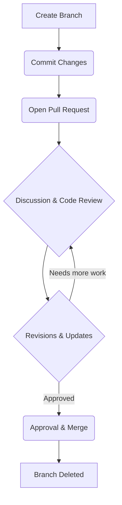

# 🧩 Understanding Pull Requests and Code Reviews on GitHub

## 📘 Overview

When working collaboratively on a Git/GitHub project, two core features ensure smooth teamwork and high-quality code:

1. **Pull Requests (PRs)** – A structured way to propose, discuss, and merge code changes.  
2. **Code Reviews** – The process of evaluating and providing feedback on those proposed changes.

Together, they form the backbone of **professional Git workflows**, ensuring that every contribution is intentional, reviewed, and tested before being merged into the main codebase.

---

## 🚀 What is a Pull Request?

A **Pull Request (PR)** is a formal request to **merge** changes from one branch into another.

You can think of it as:

> “I’ve made some improvements — please review them and merge if appropriate.”

Pull Requests help the team to:

* Review code before merging
* Discuss implementation details
* Automatically test changes via CI/CD pipelines
* Maintain a clear and traceable contribution history

---

## 🔁 How a Pull Request Works (Workflow)

### 1. Create a Branch or Fork

* If you have write access to the repository: create a **branch** in the same repository.  
  Example: `feature/add-login-page`
* If you don’t: **fork** the repository and work on your own copy.

### 2. Commit Your Changes

After making updates, commit them to your branch:

Este bloco de Markdown está completo e segue o fluxo exato que indicaste, formatado para ser copiado diretamente para o teu `README` do GitHub:

-----


 2. Commitar as Tuas Alterações

Depois de fazeres as tuas atualizações, deves commitar estas alterações para a tua *branch*:

```bash
git add .
git commit -m "feat(login): add user authentication flow"
````

### 3\. Fazer Push da Branch para o GitHub

Publica a tua *branch* no repositório remoto (o `origin`):

```bash
git push origin feature/add-login-page
```

### 4\. Abrir um Pull Request (PR)

Vai ao repositório no GitHub:

  * Clica em **Compare & pull request**.
  * **Seleciona as branches:**
      * **Base branch** → Onde queres integrar (e.g., `main`)
      * **Compare branch** → A tua *feature branch*
  * **Adiciona:** Um título claro e uma descrição detalhada (*o quê, o porquê e o como*).

**Exemplo de Descrição:**

```
Title: Implement user authentication flow
Description:
Implements login and logout using JWT tokens.
Includes form validation and session persistence.
```

### 5\. Discutir e Rever

Os membros da equipa comentam, fazem perguntas e sugerem alterações diretamente no PR.

### 6\. Integrar (*Merge*) ou Fechar

Quando o PR é aprovado e passa todos os testes:

  * É integrado (*merged*) na *base branch*.
  * A *feature branch* pode ser apagada em segurança.

-----

### ⚙️ Opções de Integração (*Merge*)

Ao integrar um PR, podes escolher entre três estratégias (vistas no GitHub):

| Tipo de Merge | Descrição | Caso de Uso |
| :--- | :--- | :--- |
| **Merge Commit** | Mantém o histórico completo e adiciona um *merge commit*. | Uso quando um histórico detalhado é necessário. |
| **Squash and Merge** | Combina todos os *commits* num só. | Mantém o histórico da `main` limpo para alterações pequenas. |
| **Rebase and Merge** | Reaplica os *commits* por cima da *target branch*. | Cria um histórico linear; usado em fluxos de trabalho avançados. |

-----

## 💬 O que é um Code Review?

Um **Code Review** é o processo de examinar o código de outro programador para garantir:

  * Qualidade e legibilidade do código.
  * Corretude e eficiência.
  * Consistência com os padrões do projeto.
  * Segurança e desempenho.
  * Entendimento partilhado entre os contribuidores.

É um processo de melhoria colaborativa, não uma crítica — o objetivo é melhorar o código, não culpar o autor.

### 🔍 O Processo de Code Review

1.  **Revisor Recebe o Pull Request**
    O revisor examina:
      * Ficheiros alterados.
      * Mensagens de *commit*.
      * Descrição do PR e *issues* associadas.
2.  **Revisão do Código**
    Os revisores podem:
      * Adicionar comentários em linhas específicas.
      * Sugerir alterações (*Suggestions*).
      * Aprovar ou pedir modificações (*Request changes*).

**Exemplo de Sugestão *inline***:

```diff
- const MAX_USERS = 500
+ const MAX_USERS = 1000 // adjusted limit based on new requirements
```

3.  **Comunicação e Iteração**
    O autor pode:

      * Responder ao *feedback*.
      * Commiter correções adicionais.
      * Fazer *push* de atualizações — todas as alterações aparecem automaticamente no mesmo PR.

4.  **Aprovação e Merge**

      * Assim que todo o *feedback* é resolvido, os revisores aprovam o PR.
      * O *Maintainer* integra (*merges*) na *main branch*.

-----

## 🧠 Melhores Práticas

### ✅ Para Pull Requests (Autores)

  * **Keep PRs small and focused** — PRs menores são mais fáceis de rever e integram mais rapidamente.
  * **Use descriptive titles and messages** — Explica claramente o quê e porquê.
  * **Include tests whenever possible** — Adiciona ou atualiza testes para novas funcionalidades.
  * **Link related issues** — Faz referência a *issues* no GitHub, por exemplo: `Fixes #42`
  * **Review your own code** — Faz uma *self-review* antes de pedir *feedback*.

### 💬 Para Code Reviews (Revisores)

| Para Autores | Para Revisores |
| :--- | :--- |
| Be clear and concise in your PR. | Be respectful and constructive. |
| Don’t take feedback personally. | Focus on the code, not the coder. |
| Respond to all comments. | Ask questions if unclear. |
| Thank reviewers for their time. | Approve quickly once issues are fixed. |

-----

## 🔁 O Ciclo de Vida do Pull Request & Review

O fluxo de trabalho típico segue esta sequência:



-----

## 💡 Exemplo Prático de Workflow

Vê o fluxo de comandos no teu terminal:

```bash
# 1. Clone the repository
git clone [https://github.com/username/repo.git](https://github.com/username/repo.git)
cd repo

# 2. Create a new branch
git checkout -b docs/explain-pull-requests

# 3. Edit documentation
nano README.md

# 4. Stage and commit your changes
git add README.md
git commit -m "docs(readme): add detailed explanation of pull requests and reviews"

# 5. Push the branch to GitHub
git push origin docs/explain-pull-requests

# 6. Open a Pull Request on GitHub
# Compare with main, describe changes, and request review
```

### 🧩 Exemplo de Conventional Commit

Ao commitar esta documentação, deves seguir o padrão [Conventional Commits](https://www.conventionalcommits.org/en/v1.0.0/):

```bash
docs(readme): add detailed explanation of pull requests and reviews
```

-----

## 📚 Recursos Adicionais

  * [GitHub Docs: About Pull Requests](https://www.google.com/search?q=https://docs.github.com/en/pull-requests/collaborating-with-pull-requests/proposing-changes-to-your-project/about-pull-requests)
  * [GitHub Docs: Reviewing Changes in Pull Requests](https://www.google.com/search?q=https://docs.github.com/en/pull-requests/collaborating-with-pull-requests/reviewing-changes-in-pull-requests/about-code-reviews)
  * [GitHub Flow Guide](https://www.google.com/search?q=https://docs.github.com/en/get-started/using-git/github-flow)
  * [Conventional Commits Specification](https://www.conventionalcommits.org/en/v1.0.0/)


